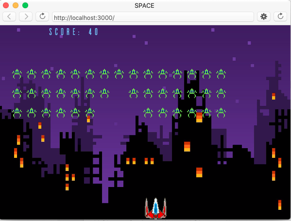

# Introduction-to-Programming-PROJECT

SPALIEN small game developed by me in my first year of University.\
To Play, launch #sketch.js in p5, follow instructions.\

\
\

Took inspiration from Daniel Shiffman YouTube channel https://www.youtube.com/watch?v=biN3v3ef-Y0

